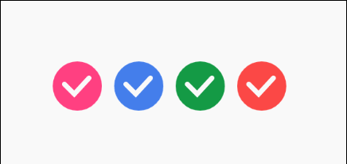

# Android 常用 View集合
这份资料主要是收集一些常用的自定义View类，为Anroid开发者提供参考，或者直接使用。
这份资料我会不断的更新完善, 同时也欢迎更多具有丰富经验的Android开发者将自己常用的工具类分享上来, 我将定期筛选合并, 该份资料有不足的地方, 也请指出, 我会谦虚接受改正, 希望我能与大家一起来成长, 谢谢.

- [自定义View基类](https://github.com/LidongWen/commonWeight/blob/master/doc/customView.md)  ：自定义View基类，帮助你节省部分代码
- [WaveLoadingView ____ 水波纹进度View](https://github.com/LidongWen/commonWeight/blob/master/doc/waveLoadingView.md)
- [RecycylerView 加头加尾 适配器](https://github.com/LidongWen/commonWeight/blob/master/doc/adapterRecy.md)
    -  相关博客：[RecyclerView封装——添加Header、Footer（在网格瀑布流布局中独占一行）](http://blog.csdn.net/sinat_15877283/article/details/50913998)
- [录音麦克风 View](https://github.com/LidongWen/commonWeight/blob/master/doc/microphoneView.md)
- [腾讯QQ_红点取消控件](https://github.com/LidongWen/StickyDot)

-[酷炫CheckBox](https://github.com/LidongWen/SmoothCheckBox)


## 引用
```groovy
// 项目引用
dependencies {
    compile 'com.github.LidongWen:commonWeight:1.0.3'
}

// 根目录下引用

allprojects {
    repositories {
        jcenter()
        maven { url "https://www.jitpack.io" }
    }
}
```

#Contact me

E-mail:wenld2014@163.com

blog: [wenld's blog](http://blog.csdn.net/sinat_15877283)
